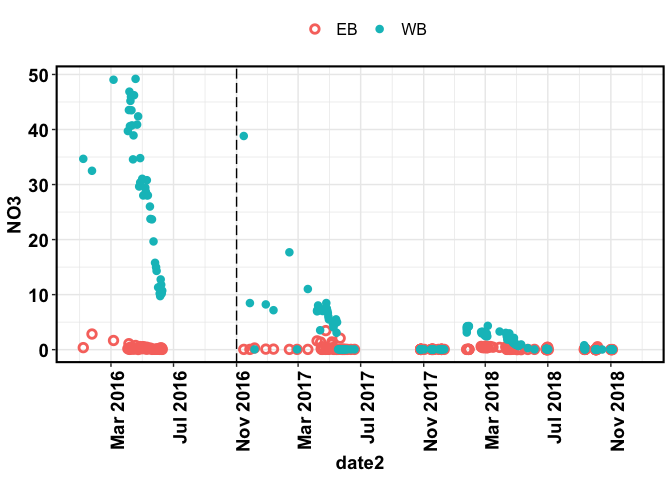
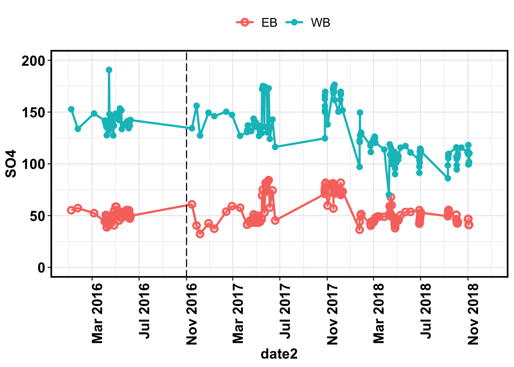

BBWM initial recovery
================
Kaizad Patel

2019-12-20

## nitrate

<!-- -->

# sulfate

<!-- -->

# DOC

<!-- -->

# ANC

<!-- -->

# pH

<!-- -->

# summary table – fluxes

| species | Watershed | pre-treatment | first decade | second decade | third decade |     recovery |
| ------: | --------: | ------------: | -----------: | ------------: | -----------: | -----------: |
|  NO3\_N |        EB |     2.56 ± NA |   0.61 ± 0.2 |   0.11 ± 0.02 |  0.07 ± 0.02 |  0.04 ± 0.01 |
|  NO3\_N |        WB |     3.02 ± NA |  5.93 ± 0.59 |    4.84 ± 0.7 |  5.89 ± 0.42 |  0.83 ± 0.47 |
|  SO4\_S |        EB |    16.22 ± NA | 13.93 ± 0.82 |  12.92 ± 0.94 | 10.27 ± 0.91 |  8.86 ± 0.25 |
|  SO4\_S |        WB |    18.83 ± NA | 26.49 ± 2.15 |   28.83 ± 2.3 |  25.92 ± 1.9 | 23.56 ± 2.01 |

<!-- --><!-- -->

# fluxes

### nitrate

<!-- --><!-- -->

## deposition

<!-- --><!-- -->
