BBWM initial recovery
================
Kaizad Patel

2020-08-23

# SUMMARY TABLE - ANNUAL CONCENTRATIONS

volume-weighted values, in mg/L of element (NO3-N and SO4-S)

| species | Watershed | pre-treatment | first decade | second decade | third decade |    recovery |
| ------: | --------: | ------------: | -----------: | ------------: | -----------: | ----------: |
|  NO3\_N |        EB |     0.26 ± NA |  0.07 ± 0.02 |      0.01 ± 0 |     0.01 ± 0 |       0 ± 0 |
|  NO3\_N |        WB |     0.28 ± NA |  0.62 ± 0.07 |   0.46 ± 0.05 |  0.55 ± 0.06 | 0.07 ± 0.04 |
|  SO4\_S |        EB |     1.67 ± NA |  1.53 ± 0.04 |   1.29 ± 0.04 |  0.92 ± 0.04 | 0.79 ± 0.02 |
|  SO4\_S |        WB |     1.74 ± NA |  2.68 ± 0.12 |   2.73 ± 0.07 |  2.35 ± 0.05 | 2.01 ± 0.17 |

overall means for treatment phase

    #> # A tibble: 2 x 3
    #>   Watershed      N     S
    #>   <chr>      <dbl> <dbl>
    #> 1 EB        0.0313  1.29
    #> 2 WB        0.538   2.61

# ANNUAL STREAM CONCENTRATIONS

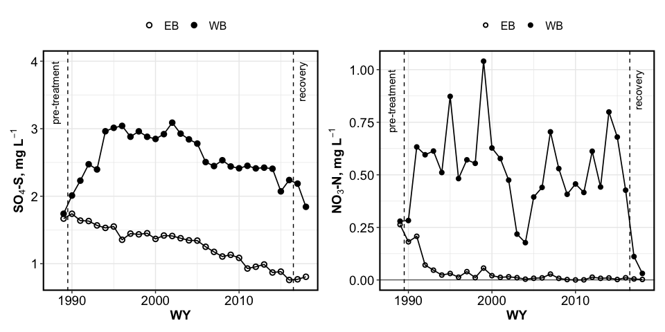<!-- -->

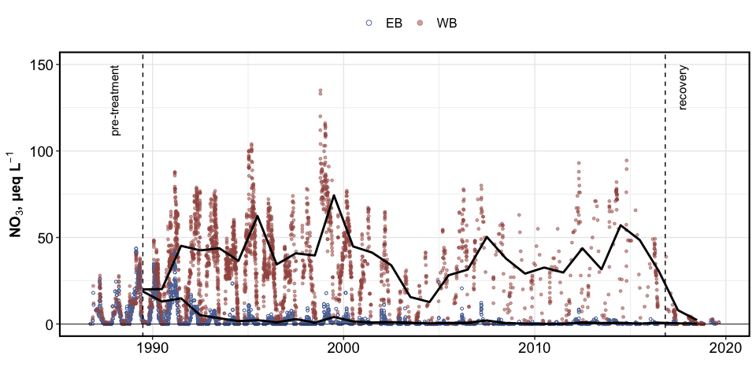<!-- -->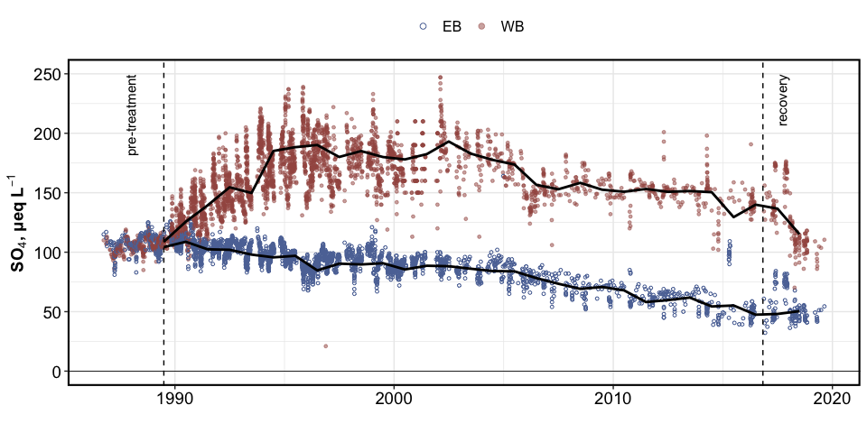<!-- --><!-- -->

# INTRA-ANNUAL CONCENTRATIONS

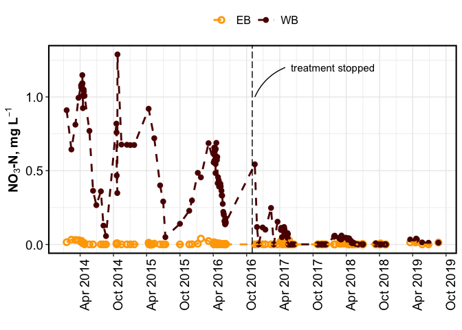<!-- -->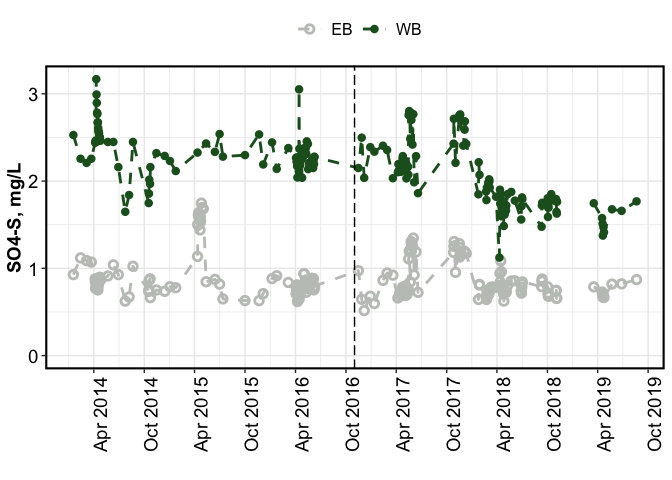<!-- -->

<!-- -->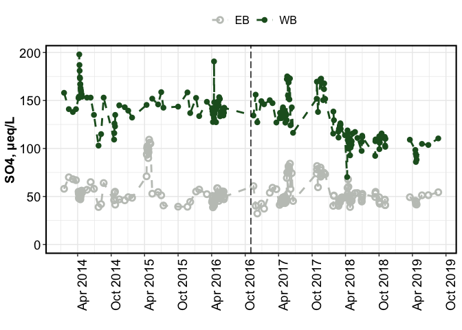<!-- -->

# deposition

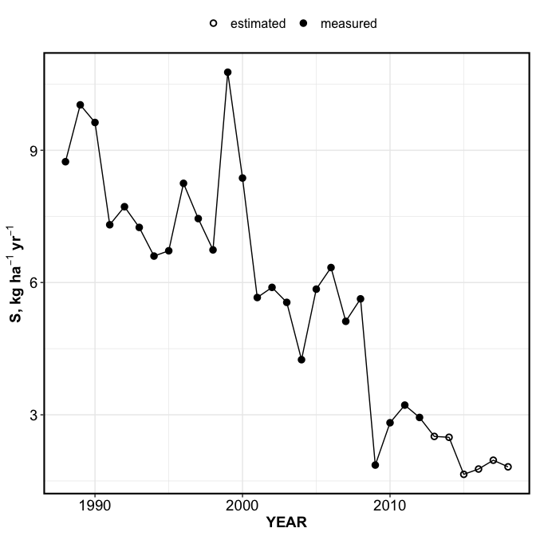<!-- -->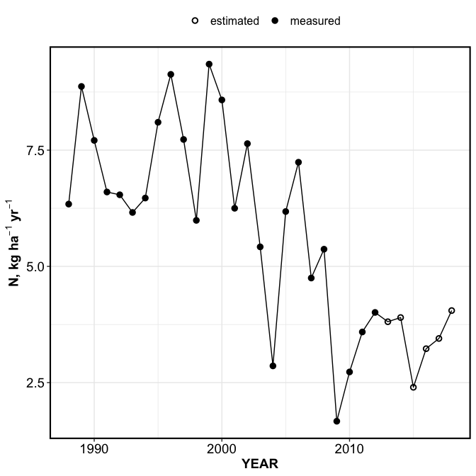<!-- -->

# RETENTION

<!-- -->

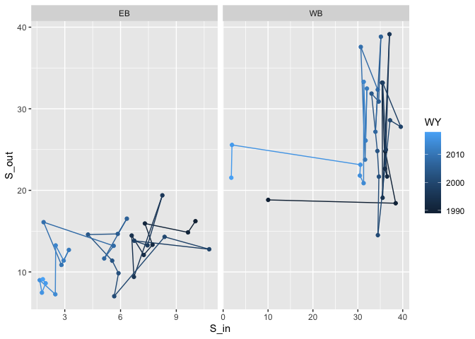<!-- -->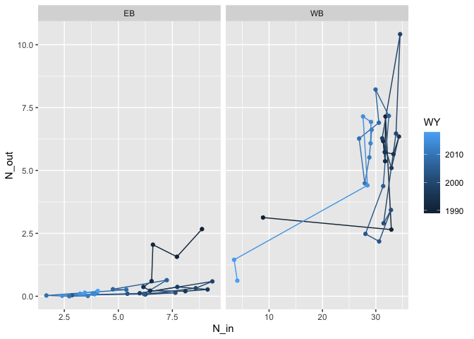<!-- -->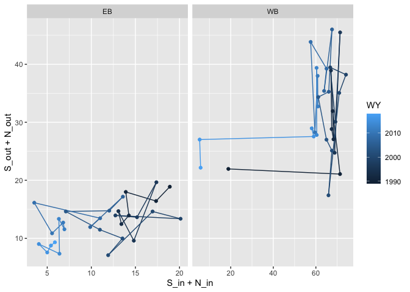<!-- -->
