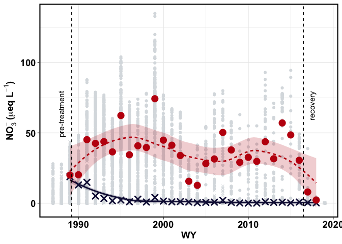
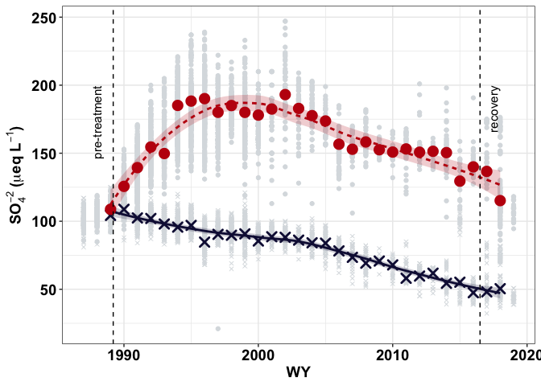
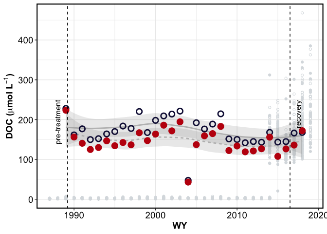
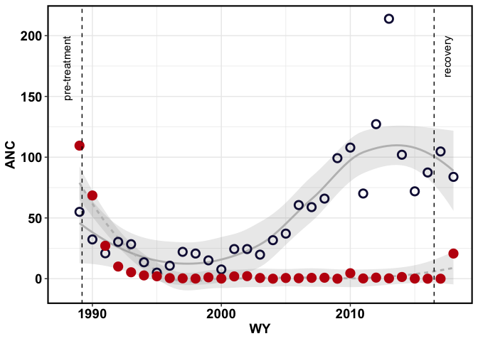
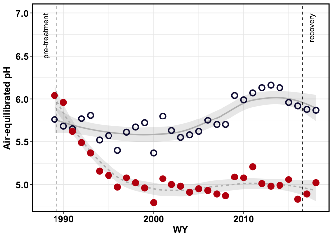
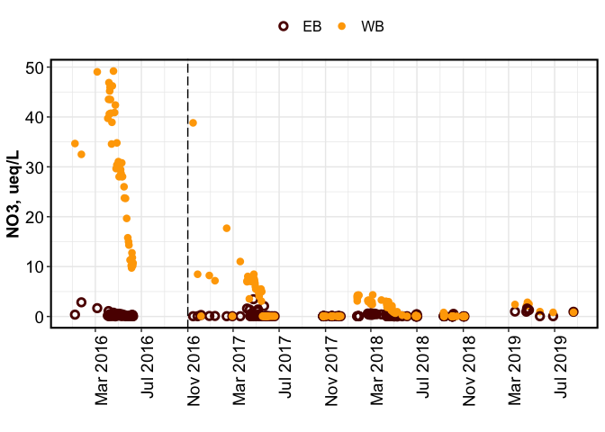
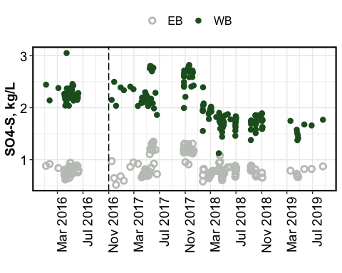
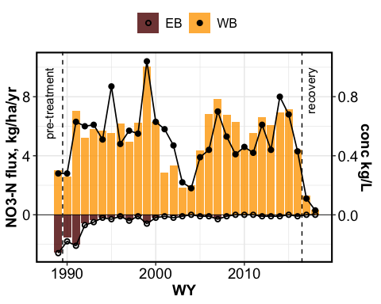
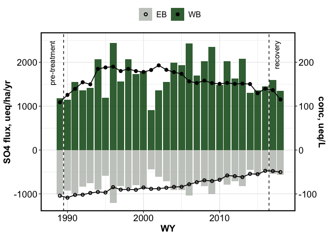

BBWM initial recovery
================
Kaizad Patel

2019-11-19

## nitrate

<!-- -->

# sulfate

<!-- -->

# DOC

<!-- -->

# ANC

<!-- -->

# pH

<!-- -->

# summary table – fluxes

| species | Watershed | pre-treatment |    first decade |   second decade |     third decade |       recovery |
| ------: | --------: | ------------: | --------------: | --------------: | ---------------: | -------------: |
|     NO3 |        EB |    182.8 ± NA |   43.38 ± 14.61 |     8.04 ± 1.76 |       4.89 ± 1.6 |    2.85 ± 0.95 |
|     NO3 |        WB |      216 ± NA |   423.6 ± 41.96 |   345.7 ± 50.03 |   420.43 ± 30.24 |    59.5 ± 33.5 |
|     SO4 |        EB |     1014 ± NA |   870.7 ± 51.51 |    807.8 ± 58.6 |   642.14 ± 57.05 |   553.5 ± 15.5 |
|     SO4 |        WB |     1177 ± NA | 1655.9 ± 134.09 | 1801.7 ± 143.94 | 1620.14 ± 118.98 | 1472.5 ± 125.5 |

<!-- --><!-- -->

## fluxes

### nitrate

<!-- --><!-- -->
