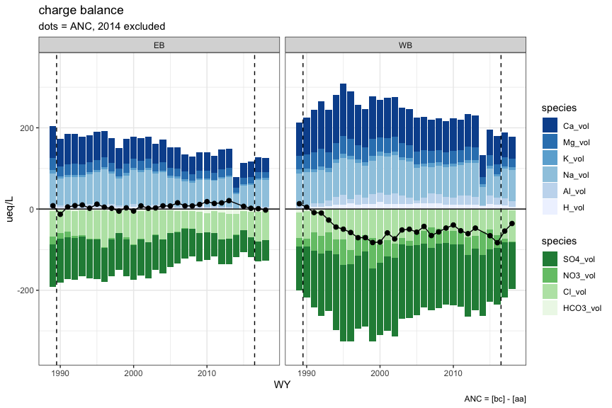
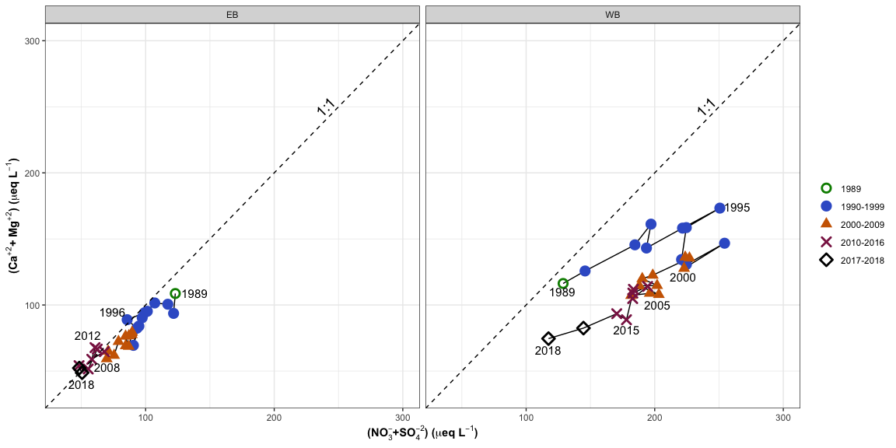
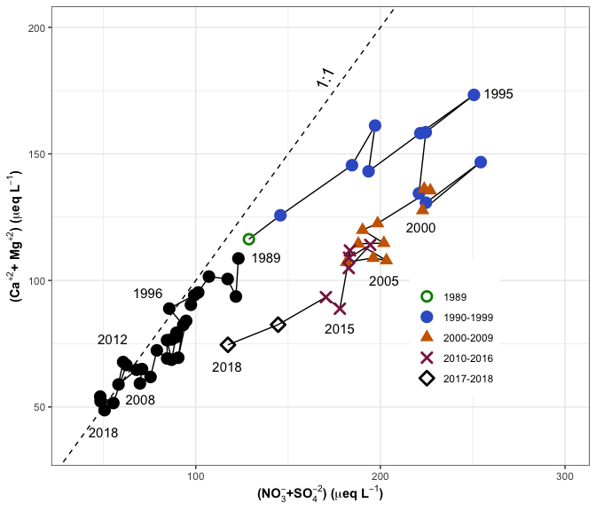

cations
================

for more cation/chemistry graphs, see
[`bbwm_recovery_cations`](https://github.com/kaizadp/bbwm_recovery_cations/blob/master/streams.md)

## charge balance

<!-- -->

-----

ANC, a measure of acidity of the solution, declined during the WB
recovery phase, suggesting a possible reduction in acidity. We therefore
investigated the base cations – Ca, Mg, Na, K. Na is almost balanced by
Cl, with a small contribution from weathering. K is typically \< 5-6
µeq/L and varies only a few µeq/L through the year. Thus, we can use,
as an approximation of the acidity of a system, (Ca + Mg) – (SO4 + NO3).

from SAN  
(The sum of base cations) minus (the sum of strong acids) is a measure
of the acidity of a solution. If negative, the ANC is negative. As the
difference grows, ANC becomes more negative and pH declines. For both EB
and WB, the major cations are Ca, Mg, Na, and K. Na is almost balanced
by Cl, with a small contribution from weathering. K is typically \< 5-6
µeq/L and varies only a few µeq/L through the year. Thus, we can use,
as an approximation of the acidity of a system, (Ca+Mg) – (SO4 + NO3).  
In EB, (Ca + Mg) declined more than (SO4 + NO3) from 1989 to about 2010,
causing a pH lower than the 1987-1989 calibration period (Fig. 8), a
trajectory related to recovery of soil base saturation. The pH is now
increasing as (Ca + Mg) continue to recover, a consequence of
restoration of base saturation from chemical weathering. In WB, (Ca +
Mg) increased dramatically during the initial years of treatment, and
(SO4 + NO3) increased more than (Ca + Mg), driving the data away from
the 1:1 line, the consequence of increasing acidity. As Ca and Mg became
depleted in the soil exchange complex and SO4 started to decline because
of declining atmospheric deposition of SO4, the annual data slid
clockwise on Figure 8, back toward the 1:1 line, and accelerated during
the two-year recovery period after treatment ceased. (Ca + Mg) and (SO4
+ NO3) in 2018 were lower than the initial values in 1989. The recovery
in WB will likely follow a path similar to that of EB, but retarded by
years.

<!-- -->

<!-- -->

-----

Session Info

Date: 2020-07-28

    #> R version 4.0.2 (2020-06-22)
    #> Platform: x86_64-apple-darwin17.0 (64-bit)
    #> Running under: macOS Catalina 10.15.6
    #> 
    #> Matrix products: default
    #> BLAS:   /Library/Frameworks/R.framework/Versions/4.0/Resources/lib/libRblas.dylib
    #> LAPACK: /Library/Frameworks/R.framework/Versions/4.0/Resources/lib/libRlapack.dylib
    #> 
    #> locale:
    #> [1] en_US.UTF-8/en_US.UTF-8/en_US.UTF-8/C/en_US.UTF-8/en_US.UTF-8
    #> 
    #> attached base packages:
    #> [1] stats     graphics  grDevices utils     datasets  methods   base     
    #> 
    #> other attached packages:
    #>  [1] harrypotter_2.1.1   drake_7.12.4        gameofthrones_1.0.2
    #>  [4] gsheet_0.4.5        googlesheets_0.3.0  agricolae_1.3-3    
    #>  [7] car_3.0-8           carData_3.0-4       nlme_3.1-148       
    #> [10] stringi_1.4.6       ggExtra_0.9         ggalt_0.4.0        
    #> [13] reshape2_1.4.4      knitr_1.29          qwraps2_0.4.2      
    #> [16] cowplot_1.0.0       data.table_1.12.8   Rmisc_1.5          
    #> [19] plyr_1.8.6          lattice_0.20-41     forcats_0.5.0      
    #> [22] purrr_0.3.4         tibble_3.0.3        tidyverse_1.3.0    
    #> [25] tidyr_1.1.0         luzlogr_0.2.0       stringr_1.4.0      
    #> [28] lubridate_1.7.9     readr_1.3.1         dplyr_1.0.0        
    #> [31] ggplot2_3.3.2       readxl_1.3.1       
    #> 
    #> loaded via a namespace (and not attached):
    #>  [1] ggnewscale_0.4.1   colorspace_1.4-1   ellipsis_0.3.1     rio_0.5.16        
    #>  [5] fs_1.4.2           rstudioapi_0.11    farver_2.0.3       fansi_0.4.1       
    #>  [9] xml2_1.3.2         extrafont_0.17     jsonlite_1.7.0     broom_0.7.0       
    #> [13] Rttf2pt1_1.3.8     cluster_2.1.0      dbplyr_1.4.4       shiny_1.5.0       
    #> [17] compiler_4.0.2     httr_1.4.2         backports_1.1.8    assertthat_0.2.1  
    #> [21] fastmap_1.0.1      cli_2.0.2          later_1.1.0.1      prettyunits_1.1.1 
    #> [25] htmltools_0.5.0    tools_4.0.2        igraph_1.2.5       gtable_0.3.0      
    #> [29] glue_1.4.1         maps_3.3.0         Rcpp_1.0.5         cellranger_1.1.0  
    #> [33] vctrs_0.3.2        extrafontdb_1.0    xfun_0.15          openxlsx_4.1.5    
    #> [37] rvest_0.3.5        mime_0.9           miniUI_0.1.1.1     lifecycle_0.2.0   
    #> [41] MASS_7.3-51.6      scales_1.1.1       hms_0.5.3          promises_1.1.1    
    #> [45] parallel_4.0.2     proj4_1.0-10       RColorBrewer_1.1-2 yaml_2.2.1        
    #> [49] curl_4.3           gridExtra_2.3      labelled_2.5.0     highr_0.8         
    #> [53] klaR_0.6-15        AlgDesign_1.2.0    filelock_1.0.2     zip_2.0.4         
    #> [57] storr_1.2.1        rlang_0.4.7        pkgconfig_2.0.3    evaluate_0.14     
    #> [61] labeling_0.3       tidyselect_1.1.0   magrittr_1.5       R6_2.4.1          
    #> [65] generics_0.0.2     base64url_1.4      combinat_0.0-8     txtq_0.2.3        
    #> [69] DBI_1.1.0          pillar_1.4.6       haven_2.3.1        foreign_0.8-80    
    #> [73] withr_2.2.0        abind_1.4-5        ash_1.0-15         modelr_0.1.8      
    #> [77] crayon_1.3.4       questionr_0.7.1    KernSmooth_2.23-17 rmarkdown_2.3     
    #> [81] progress_1.2.2     grid_4.0.2         blob_1.2.1         reprex_0.3.0      
    #> [85] digest_0.6.25      xtable_1.8-4       httpuv_1.5.4       munsell_0.5.0
