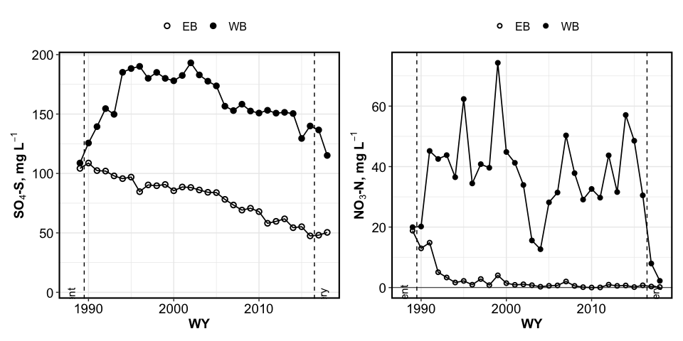
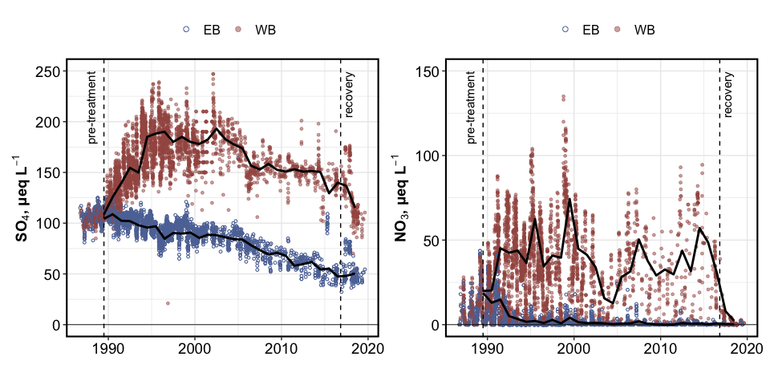
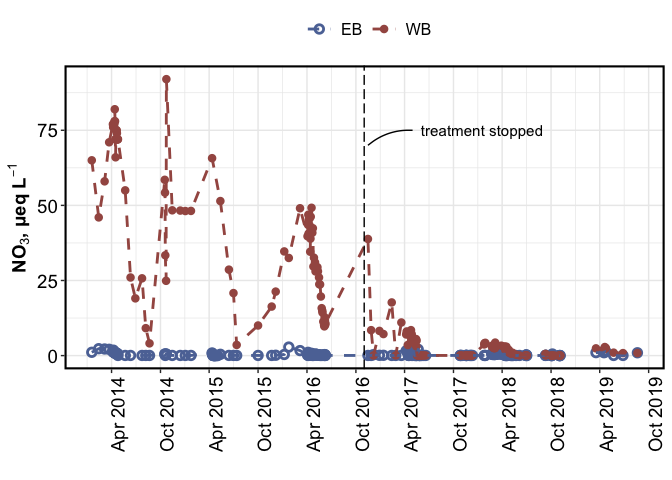
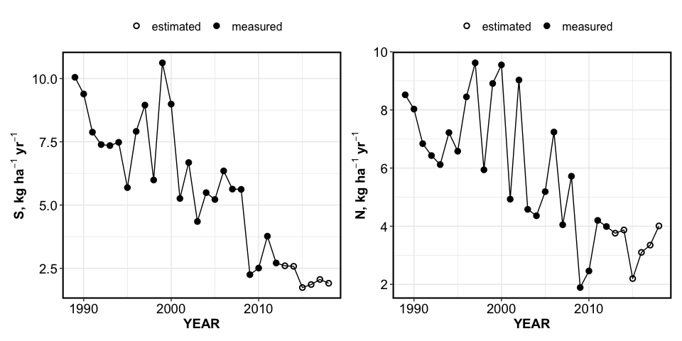
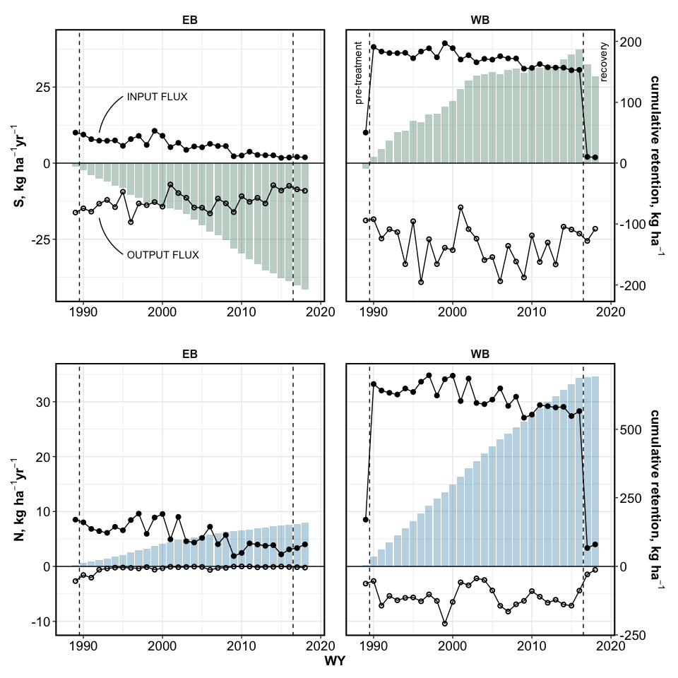

BBWM initial recovery
================
Kaizad Patel

Markdown report for N+S results

# SUMMARY TABLE - ANNUAL STREAM CONCENTRATIONS

volume-weighted values, in μeq/L of element (NO3-N and SO4-S)

|          species | Watershed | pre-treatment |  first decade | second decade |  third decade |      recovery |
| ---------------: | --------: | ------------: | ------------: | ------------: | ------------: | ------------: |
| NO3\_vol\_ueq\_L |        EB |     18.8 ± NA |   4.87 ± 1.57 |   0.84 ± 0.18 |   0.45 ± 0.14 |   0.26 ± 0.09 |
| NO3\_vol\_ueq\_L |        WB |    19.97 ± NA |  43.97 ± 4.72 |  32.51 ± 3.78 |   39.1 ± 4.06 |   5.08 ± 2.87 |
| SO4\_vol\_ueq\_L |        EB |   104.27 ± NA |  95.92 ± 2.29 |   80.8 ± 2.32 |  57.79 ± 2.43 |  49.25 ± 1.18 |
| SO4\_vol\_ueq\_L |        WB |   108.79 ± NA | 167.81 ± 7.38 | 170.82 ± 4.59 | 146.58 ± 3.29 | 125.9 ± 10.73 |

overall means for treatment phase

| Watershed | N\_ueq\_L | S\_ueq\_L |
| :-------- | --------: | --------: |
| EB        |  2.232222 |  80.43704 |
| WB        | 38.461481 | 163.41889 |

# ANNUAL STREAM CONCENTRATIONS

<!-- -->

<!-- -->

# INTRA-ANNUAL STREAM CONCENTRATIONS

<!-- --><!-- -->

# AMBIENT ATMOSPHERIC DEPOSITION

<!-- -->

# ECOSYSTEM RETENTION

<!-- -->

-----

Session Info

Date: 2020-10-24

    #> R version 4.0.2 (2020-06-22)
    #> Platform: x86_64-apple-darwin17.0 (64-bit)
    #> Running under: macOS Catalina 10.15.6
    #> 
    #> Matrix products: default
    #> BLAS:   /Library/Frameworks/R.framework/Versions/4.0/Resources/lib/libRblas.dylib
    #> LAPACK: /Library/Frameworks/R.framework/Versions/4.0/Resources/lib/libRlapack.dylib
    #> 
    #> locale:
    #> [1] en_US.UTF-8/en_US.UTF-8/en_US.UTF-8/C/en_US.UTF-8/en_US.UTF-8
    #> 
    #> attached base packages:
    #> [1] stats     graphics  grDevices utils     datasets  methods   base     
    #> 
    #> other attached packages:
    #>  [1] patchwork_1.0.1   harrypotter_2.1.1 drake_7.12.4      agricolae_1.3-3  
    #>  [5] car_3.0-9         carData_3.0-4     nlme_3.1-148      stringi_1.4.6    
    #>  [9] ggExtra_0.9       ggalt_0.4.0       reshape2_1.4.4    knitr_1.29       
    #> [13] qwraps2_0.4.2     cowplot_1.0.0     data.table_1.13.0 Rmisc_1.5        
    #> [17] plyr_1.8.6        lattice_0.20-41   luzlogr_0.2.0     lubridate_1.7.9  
    #> [21] readxl_1.3.1      forcats_0.5.0     stringr_1.4.0     dplyr_1.0.1      
    #> [25] purrr_0.3.4       readr_1.3.1       tidyr_1.1.1       tibble_3.0.3     
    #> [29] ggplot2_3.3.2     tidyverse_1.3.0  
    #> 
    #> loaded via a namespace (and not attached):
    #>  [1] colorspace_1.4-1   ellipsis_0.3.1     rio_0.5.16         fs_1.5.0          
    #>  [5] rstudioapi_0.11    farver_2.0.3       fansi_0.4.1        xml2_1.3.2        
    #>  [9] extrafont_0.17     jsonlite_1.7.0     broom_0.7.0        Rttf2pt1_1.3.8    
    #> [13] cluster_2.1.0      dbplyr_1.4.4       shiny_1.5.0        compiler_4.0.2    
    #> [17] httr_1.4.2         backports_1.1.8    assertthat_0.2.1   fastmap_1.0.1     
    #> [21] cli_2.0.2          later_1.1.0.1      prettyunits_1.1.1  htmltools_0.5.0   
    #> [25] tools_4.0.2        igraph_1.2.5       gtable_0.3.0       glue_1.4.1        
    #> [29] maps_3.3.0         Rcpp_1.0.5         cellranger_1.1.0   vctrs_0.3.2       
    #> [33] extrafontdb_1.0    xfun_0.16          openxlsx_4.1.5     rvest_0.3.6       
    #> [37] mime_0.9           miniUI_0.1.1.1     lifecycle_0.2.0    MASS_7.3-51.6     
    #> [41] scales_1.1.1       hms_0.5.3          promises_1.1.1     parallel_4.0.2    
    #> [45] proj4_1.0-10       RColorBrewer_1.1-2 yaml_2.2.1         curl_4.3          
    #> [49] gridExtra_2.3      labelled_2.5.0     highr_0.8          klaR_0.6-15       
    #> [53] AlgDesign_1.2.0    filelock_1.0.2     zip_2.1.0          storr_1.2.1       
    #> [57] rlang_0.4.7        pkgconfig_2.0.3    evaluate_0.14      labeling_0.3      
    #> [61] tidyselect_1.1.0   magrittr_1.5       R6_2.4.1           generics_0.0.2    
    #> [65] base64url_1.4      combinat_0.0-8     txtq_0.2.3         DBI_1.1.0         
    #> [69] pillar_1.4.6       haven_2.3.1        foreign_0.8-80     withr_2.2.0       
    #> [73] abind_1.4-5        ash_1.0-15         modelr_0.1.8       crayon_1.3.4      
    #> [77] questionr_0.7.1    KernSmooth_2.23-17 rmarkdown_2.3      progress_1.2.2    
    #> [81] grid_4.0.2         blob_1.2.1         reprex_0.3.0       digest_0.6.25     
    #> [85] xtable_1.8-4       httpuv_1.5.4       munsell_0.5.0
